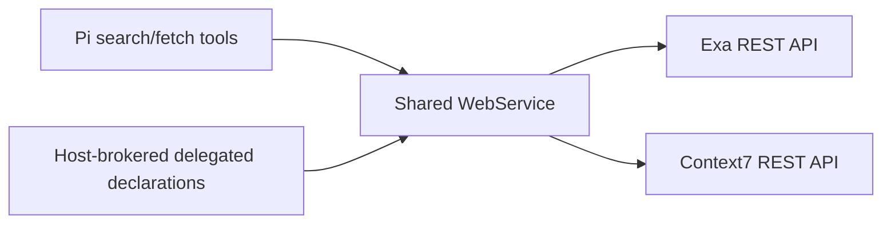

# Architecture

`pi-web` owns provider-neutral external discovery and retrieval. It does not own
model execution, delegated agents, workflows, publication, browser automation,
or repository mutation.

## Invariants

- Search discovers compact references; fetch retrieves bounded content.
- Routing is explicit and deterministic, never keyword-classified.
- Provider credentials remain host-side and are redacted from failures.
- Every request combines caller cancellation with a bounded timeout.
- Provider responses are read through a hard byte ceiling and runtime-validated.
- Tool names, schemas, descriptions, authority, implementation, and identity
  derive from one declaration.
- The service provider publishes exact bound delegated declarations from the
  same tool registry; credentials and provider clients remain host-side.
- The extension registers one lazy process-local service provider and verifies
  at session startup that Pi selected its declarations for `search` and `fetch`.
  Pi's first-registration behavior keeps later duplicate declarations inactive.

## References

Web results use canonical HTTP(S) URLs. Documentation results use
`context7:library:<library-id>`. Exa temporary document IDs are not durable
references.

The first slice has no persistent resource store. Future large pages and public
repository snapshots require bounded digest-verified artifacts before delegated
VM projection.
